# Cybersecurity Analysis and Insights

## Introduction
This repository contains an in-depth analysis of a cybersecurity dataset. The primary goal is to identify patterns, vulnerabilities, and trends in cyberattacks by leveraging various visualizations and statistical insights. The project provides actionable insights for enhancing cybersecurity measures.

## Dataset Description
The dataset includes records of network activity and potential cyberattacks. It contains the following key features:

- **Timestamp**: Date and time of the event.
- **Source IP Address**: The IP address initiating the communication.
- **Destination IP Address**: The target IP address.
- **Source Port**: The port used by the source IP.
- **Destination Port**: The port targeted by the communication.
- **Protocol**: The network protocol used (e.g., TCP, UDP, ICMP).
- **Packet Length**: Size of the network packet.
- **Packet Type**: Indicates the type of packet (Data or Control).
- **Traffic Type**: Categorizes traffic (e.g., HTTP, DNS).
- **Payload Data**: Captures payload content in text format.
- **Anomaly Scores**: Assigned score indicating anomaly level.
- **Severity Level**: Categorizes the severity of the event.
- **Log Source**: Indicates the source generating the log (e.g., Server, Firewall).
- **Temporal Features**: Derived features like Year, Month, Day, Hour, etc.

### Dataset at a Glance
The dataset contains 33 columns, offering rich contextual information for analysis.

---

## Visualizations and Insights

### 1. Top 10 Source IPs
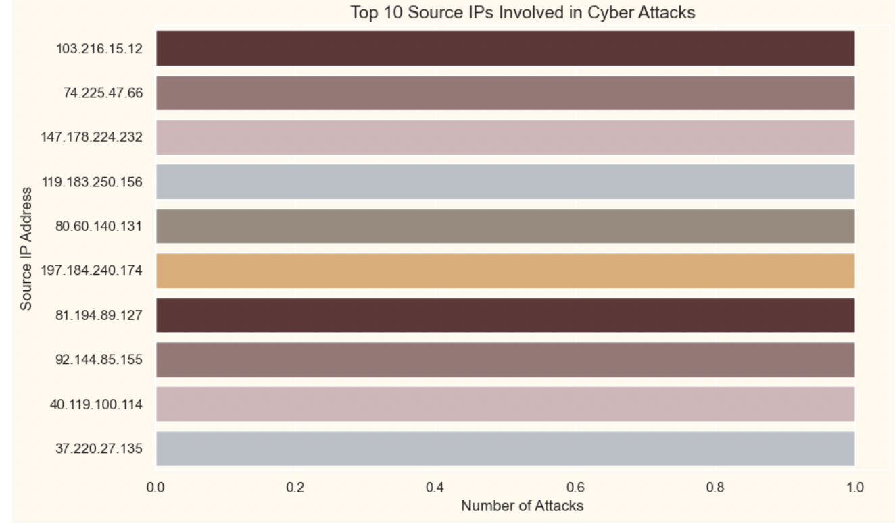
**Observations:**
- IP `103.216.15.12` is the most active source of cyberattacks, suggesting a high-priority target for mitigation measures.
- The distribution of attacks across IPs is relatively balanced, indicating multiple sources of threats.
- Continuous blacklisting and monitoring of these IPs can significantly reduce attack volumes.

### 2. Top 10 Destination Ports
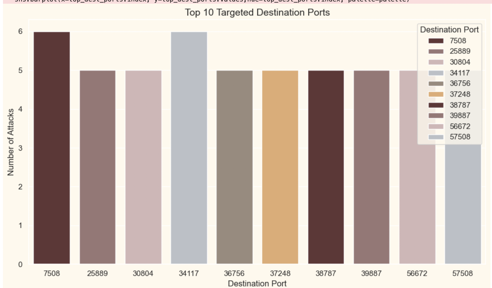
**Observations:**
- Ports such as 7508 and 25889 are the most targeted, reflecting specific application vulnerabilities or configurations.
- The distribution is relatively even, suggesting diverse attack vectors across various services.
- Security measures like firewall rules should focus on the top targeted ports to mitigate risks.

### 3. Distribution of Packet Lengths
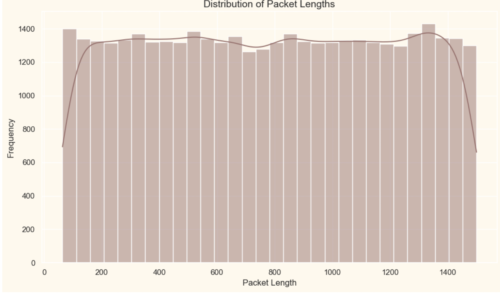
**Observations:**
- Packet lengths are evenly distributed, with a slight concentration around the median.
- The smooth density curve suggests consistent traffic flow, likely dominated by normal activity.
- Small spikes near the tails may indicate anomalies or specific types of traffic worth investigating.

### 4. Attack Type vs Severity Level
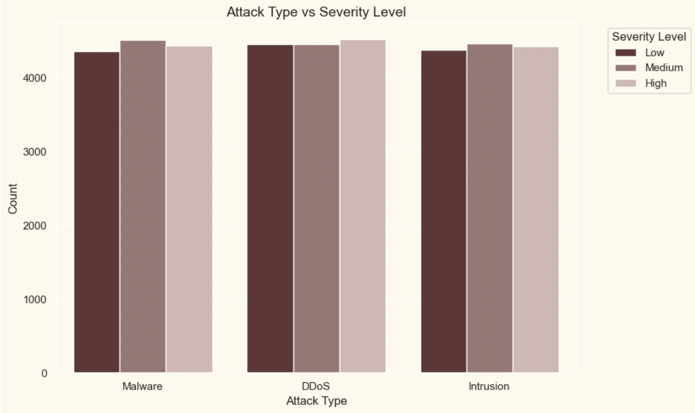
**Observations:**
- All attack types (Malware, DDoS, Intrusion) are evenly distributed across severity levels, highlighting consistent impacts across categories.
- Intrusion attacks show slightly more occurrences at medium severity, indicating a higher tendency to escalate.
- DDoS attacks contribute significantly to high-severity incidents, emphasizing the need for mitigation strategies.

### 5. Hourly Trends in Cyber Attacks
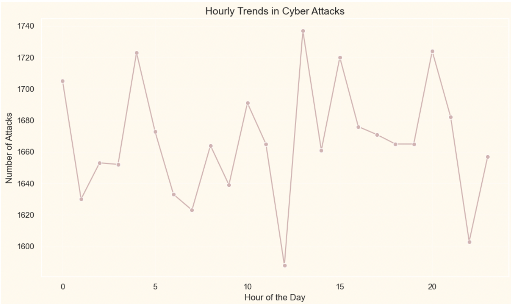
**Observations:**
- Cyberattacks show periodic spikes, with significant peaks during certain hours of the day, possibly indicating attacker behavior patterns or automated scripts.
- A noticeable dip in attacks occurs during late night hours, suggesting less activity in specific time zones.
- High variability in attack frequencies across the day indicates the need for continuous monitoring.

### 6. Anomaly Scores by Severity
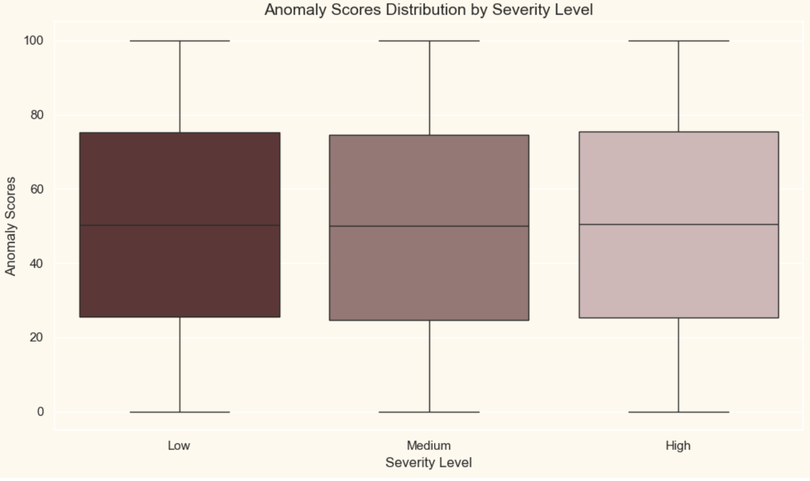
**Observations:**
- Higher severity levels generally align with higher anomaly scores, indicating a strong correlation between anomaly detection and severity classification.
- The range of anomaly scores increases as the severity level escalates, with low severity having a narrower distribution compared to high severity.
- Outliers in the low and medium severity levels may warrant further investigation to refine detection algorithms.

### 7. Top Network Segments
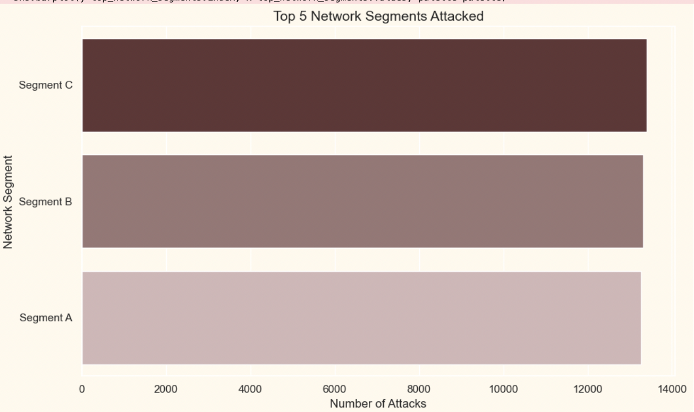
**Observations:**
- Segment C is the most targeted, indicating potential vulnerabilities or critical infrastructure.
- All three segments show similar attack levels, suggesting widespread threats across various network areas.
- Resource allocation and defense mechanisms should focus equally on all segments to ensure comprehensive security.

### 8. Month-wise Trends
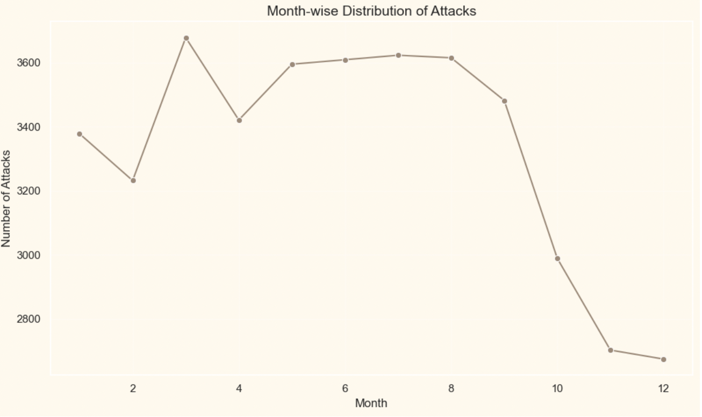
**Observations:**
- The first half of the year (January to June) sees higher attack frequencies, with peaks in February and April, possibly correlating with global events or attack campaigns.
- A sharp decline in attack frequency occurs from September onward, indicating a seasonal trend.
- The trend suggests that resources should be allocated more heavily in the earlier months to mitigate heightened activity.

### 9. Alerts Breakdown
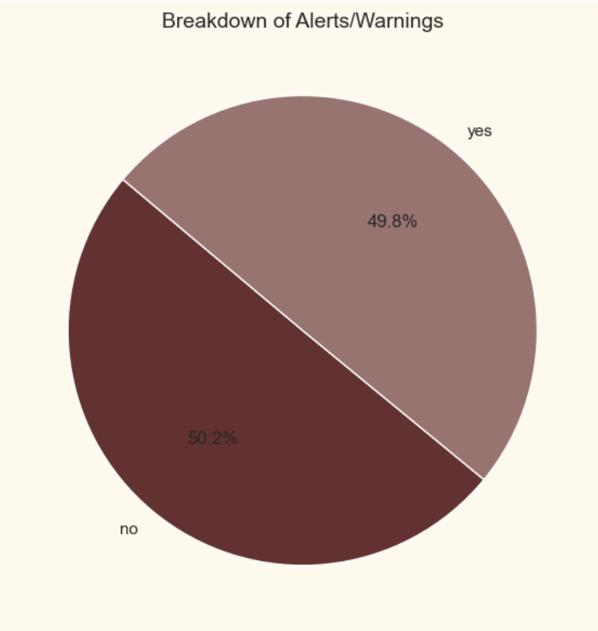
**Observations:**
- Alerts and warnings are evenly split, suggesting balanced detection of normal and suspicious activities.
- The high percentage of warnings (`50.2%`) indicates room for improving false positive rates.
- A near-equal distribution highlights effective monitoring but may also reflect limitations in detection thresholds.

### 10. Traffic Types
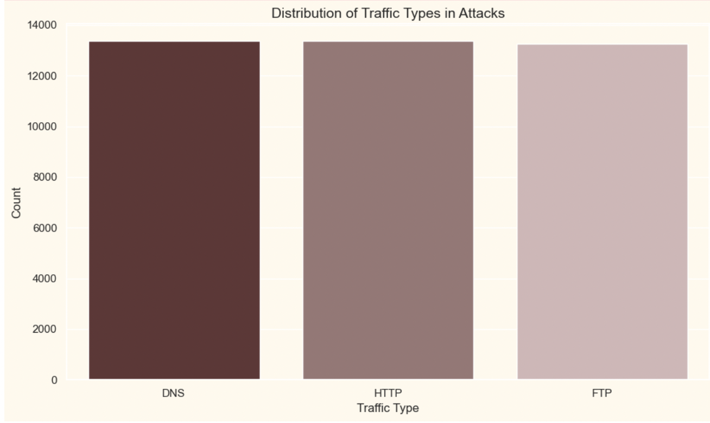
**Observations**
- DNS and HTTP traffic types are most frequently associated with attacks, reflecting their ubiquity in network communications.
- FTP traffic, although less common, still shows a considerable number of attack instances, indicating its vulnerability.
- The even distribution highlights the need for security measures across all traffic types.

### 11. Distribution of Attack Types by Browser
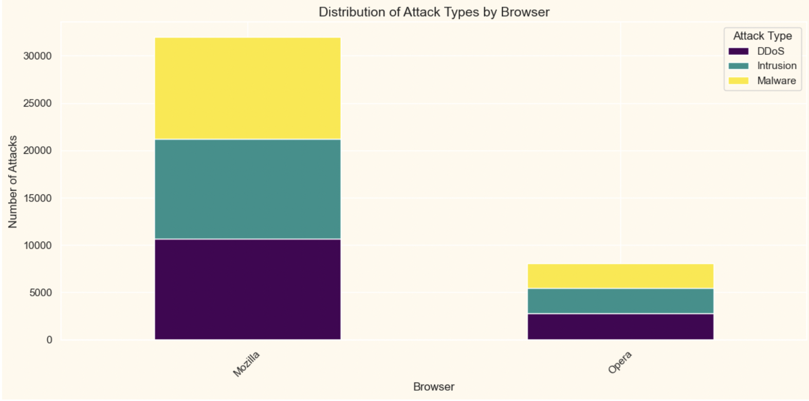
**Observations:**
- Mozilla browsers are disproportionately targeted, with Malware and Intrusion leading the attack types.
- Opera has fewer attack instances, reflecting its smaller user base or better security measures.
- Malware is the dominant attack type across both browsers, necessitating enhanced security protocols.

### 12. Distribution of Attack Types by Device/OS
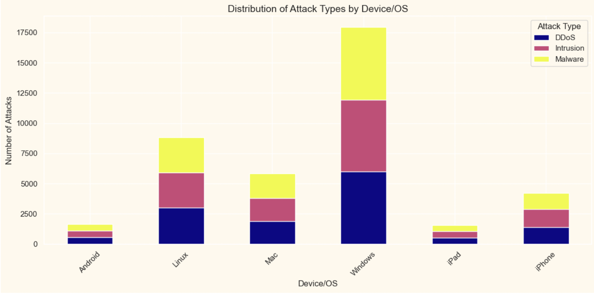
**Observations:**
- Windows devices are the most targeted, with Malware accounting for the majority of attacks.
- Linux and MacOS also show significant vulnerabilities, particularly for Intrusion attempts.
- Mobile devices (Android, iOS) have fewer attacks, possibly due to better isolation and security controls.

### 13. Top Actions Taken
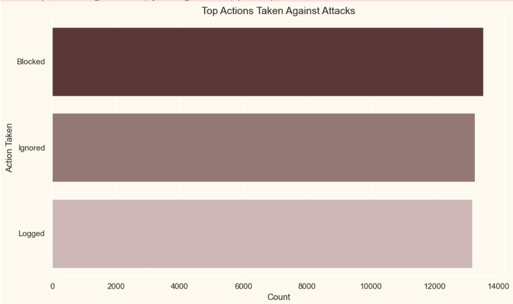
**Observations:**
- Logging is the most frequent response to attacks, indicating a focus on tracking and monitoring.
- Ignoring certain events reflects potential false positives or low-priority attacks.
- Blocking is a significant action, showing proactive measures to prevent recurring incidents.

### 14. Protocol Usage Distribution
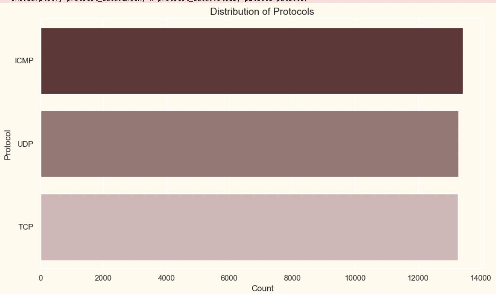
**Observations:**
- TCP dominates the protocol distribution, reflecting its widespread use in most applications.
- UDP shows significant usage, likely due to real-time data transmissions or DNS traffic.
- ICMP has the lowest count, typically associated with diagnostic or control messages.

### 15. Top 5 States Affected by Cyber Attacks

**Observations:**
- Ghaziabad in Meghalaya experiences the highest number of attacks, indicating concentrated vulnerabilities.
- Smaller states like Nagaland and Tripura also show significant attack levels, highlighting the need for robust security measures in underrepresented areas.
- Regional patterns may indicate specific attacker strategies or infrastructure weaknesses.
  
### 16. Average Packet Length by Traffic Type (Monthly Trend)
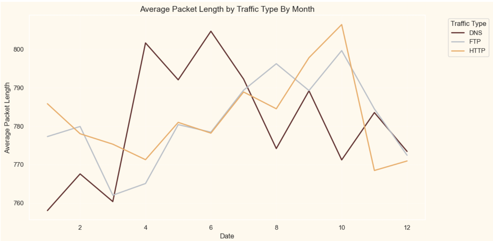

**Observations:**
- DNS shows peaks during specific months, which could correlate with increased attack campaigns or system updates.
- HTTP maintains a relatively consistent average throughout the months, reflecting stable usage patterns.
- FTP displays sharp spikes and drops, suggesting inconsistent usage or targeted attack behaviors.

### 17. Average Packet Length by Traffic Type (Yearly Trend)
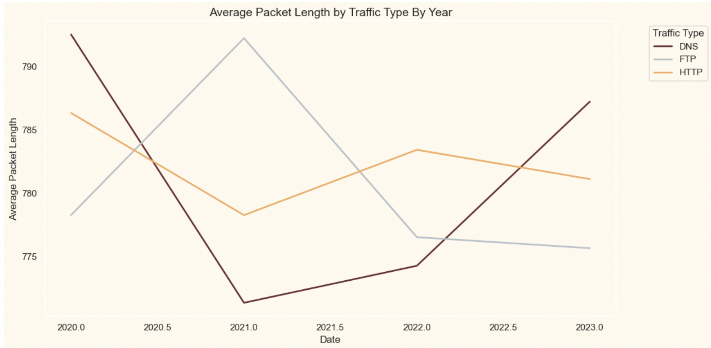
**Observations:**
- DNS traffic exhibits an increasing trend in average packet length over the years, possibly due to expanded payloads.
- FTP shows inconsistent fluctuations, which might indicate irregular usage or varying transfer sizes.
- HTTP maintains a steady trajectory, reflecting consistent payload sizes across its usage.

---

## Methodology
### Steps Taken:
1. **Data Cleaning**: Handled missing values and standardized formats.
2. **Feature Engineering**: Derived additional temporal features (e.g., Day of Week, Hour).
3. **Visualization**: Created 16 visualizations using Matplotlib and Seaborn to extract meaningful patterns.
4. **Analysis**: Conducted storytelling for each visualization to provide actionable insights.

---

## Conclusion
This analysis offers a comprehensive view of the cyber threat landscape. Key findings include:
- Identifying high-risk IPs, ports, and network segments.
- Unveiling temporal patterns to optimize monitoring efforts.
- Providing insights into attack types and severity levels for targeted defense.

**Recommendations**:
1. Prioritize monitoring high-risk IPs and ports.
2. Fortify vulnerable network segments and devices.
3. Regularly update protocols and browsers to address known vulnerabilities.
4. Leverage anomaly scores to preemptively mitigate high-severity incidents.

This repository serves as a foundational resource for enhancing cybersecurity strategies and decision-making.
